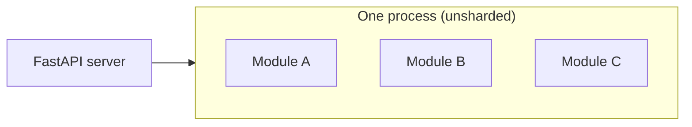
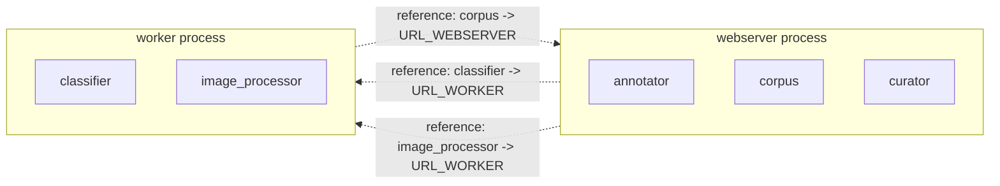
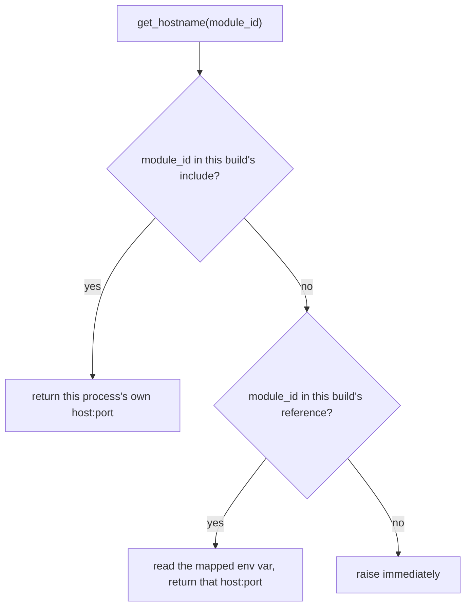
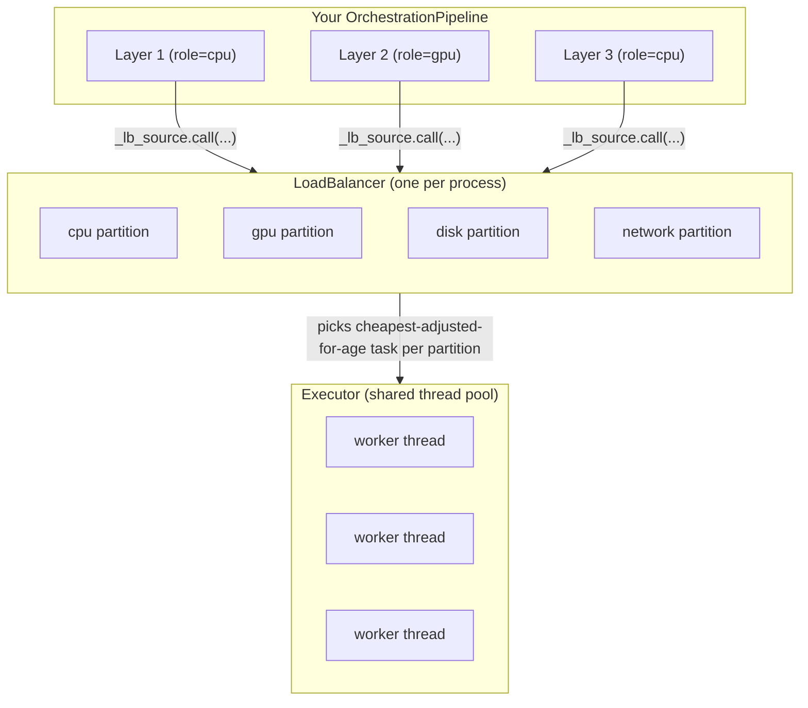
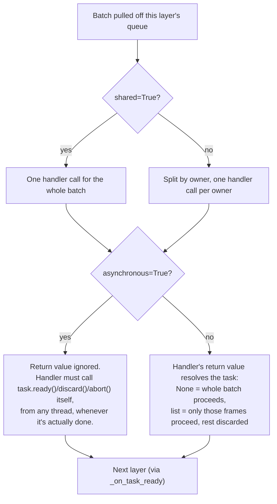
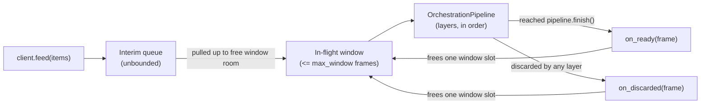

# nam

Not Another Monolith: a modular runtime architecture for AI workloads.

nam is a modular runtime for building and serving AI workloads. A nam
project is a set of self-contained modules, each with its own backend routes
and (optional) frontend bundle, mounted under a single FastAPI server. At the core of
nam is `nam.concurrency`, a batching orchestrator built for running
multi-stage CPU, GPU, disk or network -bound work without every module having to hand-roll
its own thread pool, batching logic, and backpressure.

The contract of nam projects is: the modules must never access each others' files directly, but instead establish a HTTP contract by which they communicate.
This allows each module to remain independent and for a single project to be **sharded** across multiple processes - possibly on different machines - without changing any module code. See [Sharding](#sharding) below.
The use of Python and React also ensures a cloud-friendly, modern approach for the application's design.

nam does not attempt to compete with platforms like Kubernetes, but is instead designed to work alongside them. Additionally, nam is intentionally minimal and lightweight and does not attempt to re-invent any wheels or force you to program against some enormous API - it enforces a maintainable, self-contained architecture and provides module resolution primitives and a unified concurrency model to work with. Whichever framework/platform you choose to run it, and whichever libraries you choose for the communication between modules, this is all up to you, and not a concern of nam.



The diagram above is the default, single-process shape. See [Sharding](#sharding) for what changes when a project outgrows one machine.


## Why does it exist?
The purpose of nam is to make complex, modular, distributed web services faster to develop, deploy, and maintain. Its cross-backend inference acceleration and concurrency orchestration aren't only intended to make production services fast, but to also make their development and testing faster.

nam is engineered explicitly for modern AI workloads, where heterogeneous compute, heavy batching, and modular isolation are first-class requirements.

## Project layout

A nam project is a directory that looks like this:

```
my-project/
  project.yaml
  builds.yaml          (optional)
  app.py              (optional)
  modules/
    my_module/
      module.yaml
      backend/
        routes.py
      frontend/
        App.jsx
  shared/
    src/              (importable by all backends)
    com/              (importable by all frontends as @shared)
```

Run it with:

```
nam my-project
```

or, to launch a single shard of the project instead of the whole thing:

```
nam my-project -build worker
```

### project.yaml

All keys are optional.

```yaml
environment: my-project   # namespaces this project's app data dir, defaults to the folder name
parallellism: auto        # worker count for the concurrency executor, or an integer
optimization: throughput  # passed through to your own module code
reload: true               # gates both the Python reloader and the frontend watcher
port: 8000                 # can be overridden with --port
```

### Modules

Each module lives in `modules/<id>/` and needs a `module.yaml`:

```yaml
name: My Module
type: site
icon: layout-template
```

and a `backend/routes.py` exposing a FastAPI `router`. nam mounts it at
`/<id>`. If a `frontend/` directory exists with an entry point
(`App.jsx`, `app.jsx`, `index.jsx`, `index.js`, or `App.js`), it gets bundled
with esbuild and served at `/bundles/<id>.js`.

### app.py

An optional `app.py` at the project root can define a `router` for routes
that apply to the whole project rather than one module, such as a
navigation endpoint or a custom root redirect. It's mounted unprefixed.

### shared/

`shared/src` is put on the Python path, so backend code across modules can
import shared library code directly. `shared/com` is aliased to `@shared` in
the frontend bundler, for shared React components. 

Ideally, shared code and components should be things specific to none of the modules, 
and contain only things that might warrant a library/libraries of their own.
Otherwise, you might risk turning the shared region into a monolith itself.

## Sharding

nam is not a monolith - it's one codebase that can run as one process or as
many. A project that outgrows a single machine (or just wants its
GPU-hungry modules scaled independently of its lightweight ones) defines
one or more **builds** in a `builds.yaml` at the project root:

```yaml
webserver:
  optimization: balance
  include:
    - annotator
    - corpus
    - curator
  reference:
    classifier: URL_WORKER
    image_processor: URL_WORKER

worker:
  optimization: throughput
  include:
    - classifier
    - image_processor
  reference:
    corpus: URL_WEBSERVER
```

Each top-level key is a build name, launched with `nam my-project -build
<name>`. A build has:

- `include`: the only modules actually started in this process. Everything
  else in the project is simply not mounted here.
- `reference`: for every module this build doesn't include but still needs
  to reach, maps that module's id to the name of an environment variable
  holding its address (e.g. `reference: {corpus: URL_WEBSERVER}` means
  `os.environ["URL_WEBSERVER"]` holds corpus's `host:port` at runtime).
- `optimization`: optional, overrides the project-level `optimization` for
  processes launched from this build.

The `builds.yaml` example above splits into two processes like this - each
box is a separate OS process, possibly on a separate machine, and the
dotted arrows are the `reference` lookups resolved through `Router` at
request time, not compile-time wiring:



Nothing about `annotator`, `corpus`, `curator`, `classifier`, or
`image_processor`'s own code changes between this sharded layout and
running the whole project unsharded in one process - only which process
each module is `include`d in, and which environment variables happen to
be set, changes. That's the property sharding is built around: a module
never hardcodes where another module lives.

Launching without `-build` at all still works exactly as before - the
whole project runs in one process, as if every module were `include`d in
one implicit build with no `reference` entries.

### Router

Module code never hardcodes another module's address. Instead it asks
`Router.get_hostname(module_id)`, which is build-aware:

```python
from fastapi import Request

def my_route(request: Request):
    corpus_url = request.app.state.router.get_hostname("corpus")
```

- If `module_id` is in this build's `include` list, `get_hostname` returns
  this process's own `http://host:port` - the module is right here.
- If `module_id` is in this build's `reference` map, `get_hostname` reads
  the mapped environment variable and returns that address instead - the
  module lives in some other process.
- If `module_id` is neither included nor referenced, `get_hostname` raises
  immediately, rather than deferring the mistake into a confusing
  connection failure later.

`request.app.state.router` covers any code running inside a FastAPI route.
For code that runs outside a request - background jobs, boot-time
requeues, module-level import side effects - use
`nam.router.get_active_router()` instead, which returns the same `Router`
this process was created with:

```python
from nam.router import get_active_router

def requeue_on_boot():
    image_processor_url = get_active_router().get_hostname("image_processor")
```

A project with no `builds.yaml` (or a launch with no `-build` flag) still
gets a fully working `Router` - every discovered module is implicitly
`include`d, so `get_hostname` always resolves locally and module code never
needs to know whether it's running sharded or as one process.



## Reload and rebuilding

When `reload: true` (the default), nam watches your project for changes:

- Python files are watched by uvicorn's own reloader and restart the server.
- Frontend sources are watched by nam itself. Each module's frontend files
  are hashed, and a rebuild only runs when the hash changes, so idle modules
  don't get rebuilt on every poll.

When `reload: false`, nam builds everything once at startup and does not
watch for changes. Either way, an existing bundle is reused across restarts
if its sources haven't changed since it was last built.

## Concurrency

`nam.concurrency` is initialized once, at server startup, before any module
code imports the orchestrator:

```python
from nam import concurrency
concurrency.initialize()  # defaults to one worker per detected core
```

This sets up a shared thread pool (`concurrency.executor`) and a global
load balancer that every `OrchestrationPipeline` schedules work through.
Modules don't create their own thread pools; they build a pipeline against
the one nam already started.

The pieces underneath, and how work actually gets from a layer to a
worker thread:



Every `OrchestrationLayer` registers its own `LoadBalancerSource` under one
of the four partitions (`role=` in `add_layer`). The `LoadBalancer` keeps a
moving average of how long each source's work actually takes and uses that
to decide what to dispatch next - so a slow `gpu` layer doesn't starve a
fast `cpu` layer sharing the same `Executor`, and a task that's been
waiting too long gets bumped ahead regardless of size. `Executor`'s
threads are undifferentiated: any worker thread may run a batch from any
layer, of any role, at any time - the partitioning happens entirely in the
`LoadBalancer`, not by giving each role its own dedicated threads.

Two more dedicated background threads exist outside this diagram,
independent of the `Executor` pool: a single scheduler thread
(`nam.concurrency.scheduler`) that all layers use for their
`yield_after`/backoff delays instead of each spinning up its own timer
thread, and, only for layers whose handler is an `async def` function, one
dedicated event loop thread per such layer (so `await`-based handlers
don't pay `asyncio`'s loop setup/teardown cost on every batch).

### Pipelines and layers

An `OrchestrationPipeline` is a chain of `OrchestrationLayer`s. Each layer
has a handler, and frames flow from one layer to the next in batches:

```python
from nam.concurrency import OrchestrationPipeline, OrchestrationFrame, OrchestrationClient

pipeline = OrchestrationPipeline(concurrency.executor)

def preprocess(owner, task, batch):
    return [f for f in batch if f.userdata is not None]

def run_model(owner, task, batch):
    for f in batch:
        f.result = model.predict(f.userdata)

pipeline.add_layer(role="cpu", handler=preprocess)
pipeline.add_layer(role="gpu", handler=run_model)
pipeline.finish()
```

Note `run_model` sets `f.result` rather than overwriting `f.userdata`:
`userdata` is whatever you fed in, and handlers generally shouldn't
clobber it with the output. Define a dedicated attribute (like `result`)
on your frame subclass for that instead - see the frame/client pattern
below.

`add_layer` takes:

- `role`: which load balancer partition this layer's work counts against
  (`cpu`, `gpu`, `disk`, or `network`). The load balancer tracks a moving
  average of how long each layer's work takes and schedules accordingly, so
  a slow GPU layer doesn't starve a fast CPU layer sharing the same executor.
- `handler(owner, task, batch)`: called with the batch of frames belonging
  to a single owner. `owner` is whichever value you fed in as an
  `OrchestrationClient`, `task` is a `Task` for signalling completion, and
  `batch` is the list of `OrchestrationFrame`s to process.
- `contiguous`: if `True`, a frame only leaves this layer once every frame
  before it (by index, for the same owner) has already left. Useful for
  layers where output order must match input order.
- `min_batch` / `max_batch`: batch size bounds. A layer won't call its
  handler until at least `min_batch` frames are queued, or `yield_after`
  seconds have passed, whichever comes first.
- `shared`: if `True`, the handler is called once per batch across all
  owners, instead of once per owner.
- `asynchronous`: if `True`, the layer doesn't wait for the handler to
  return before moving on. The handler is responsible for calling
  `task.ready(...)` or `task.abort()` itself, whenever it's actually done
  (which can be from another thread, later).

Put together, this is what happens to one pulled batch inside
`_execute_batch`, matching the code path exactly (`shared` decides how the
batch is grouped before the handler runs at all; `asynchronous` decides
whether anything downstream happens on return at all):



A handler that calls `task.ready()`/`discard()`/`abort()` itself under
`asynchronous=False` is also fine, and wins over the return value if it
resolves first (it always does, since it necessarily runs before the
handler can return) - but returning a non-`None` value on top of that is a
bug: the return value is silently discarded and logged as a conflict,
since the manual call already settled the task. Do exactly one or the
other.

### Handler return values

For a non-asynchronous layer, what the handler returns decides what
proceeds to the next layer:

- Returning `None` (including simply not returning anything) passes the
  whole batch through unchanged.
- Returning a list of frames passes through only those frames. Anything in
  the original batch that isn't in the returned list is discarded: it
  won't reach the next layer, and it won't be requeued.

```python
def filter_bad_frames(owner, task, batch):
    return [f for f in batch if f.userdata.is_valid]
```

### Tasks

Every handler call gets a `Task`. Calling `task.ready(batch)` explicitly
does the same job as a return value, but works for asynchronous layers too,
and can be called from a different thread than the one that ran the
handler:

```python
def dispatch_to_worker(owner, task, batch):
    def on_worker_done(results):
        survivors = [f for f, r in zip(batch, results) if r is not None]
        task.ready(survivors)

    worker_pool.submit(batch, callback=on_worker_done)

pipeline.add_layer(role="gpu", handler=dispatch_to_worker, asynchronous=True)
```

`task.ready()` with no argument passes the whole original batch through,
same as returning `None`. `task.abort()` discards the whole batch, the same
as `task.ready([])`.

Both `ready()` and `discard()` also accept a single `OrchestrationFrame`
instead of a batch - useful in asynchronous layers where frames finish one
at a time rather than all together:

```python
def dispatch_to_worker(owner, task, batch):
    def on_item_done(frame, result):
        if result is None:
            task.discard(frame)
        else:
            frame.result = result
            task.ready(frame)

    for f in batch:
        worker_pool.submit(f, callback=on_item_done)

pipeline.add_layer(role="gpu", handler=dispatch_to_worker, asynchronous=True)
```

A task settles on its first `ready()`/`discard()`/`abort()` call made
*without* a specific frame or batch (i.e. resolving the whole task at
once). After that, further single-frame `ready(frame)`/`discard(frame)`
calls are still honored as long as they name frames that haven't already
been claimed - this is what lets a streaming/asynchronous handler resolve
frames one at a time as they complete, from any thread, without every
frame needing to be ready simultaneously. Once every frame in the batch
has been claimed, the task is fully resolved.

### OrchestrationClient

`OrchestrationClient` sits in front of a pipeline and manages a bounded
window of in-flight work for one logical caller. Prefer subclassing it
over using the lower-level `Orchestrator` directly - see the
`FirstClient`/`SecondClient` pattern in
`examples/nested_orchestration.py` for the recommended shape:

```python
class MyFrame(OrchestrationFrame):
    def __init__(self, index, userdata):
        super().__init__(userdata=userdata)
        self.result = None

class MyClient(OrchestrationClient):
    def __init__(self):
        super().__init__(pipeline, max_window=256)

    def _create_frame(self, index, userdata):
        return MyFrame(index, userdata)

client = MyClient()
client.on_ready(lambda frame: print(frame.result))
client.feed([item_a, item_b, item_c])
```

Each item you feed becomes a frame (via `_create_frame`) and enters the
pipeline at the first layer. `max_window` caps how many frames can be in
flight at once; once frames finish (reach the end of the pipeline, added
with `pipeline.finish()`), room frees up and more queued items are pulled
in. Register `on_ready`/`on_discarded` callbacks to get frames back one at
a time as they complete or get dropped, and `on_dispatch` if you need to
record caller-side context per fed item (see the docstring on
`OrchestrationClient` for the nested-client use case this is for).



Feeding more items than `max_window` doesn't block or error - they queue
in the unbounded interim queue and get pulled into the window as slots
free up. This is what actually provides backpressure: a slow pipeline
just means the window stays full and the interim queue grows, rather than
every fed item spawning unbounded concurrent work.

Call `client.close()` when you're done with it, to clear any per-owner
backlog state held by `contiguous` layers.

The lower-level `Orchestrator(pipeline, max_window)` that `OrchestrationClient`
wraps is still available directly if you don't need per-item frame
subclassing, but for most module code the client pattern above is what
you want.

## Inference

`nam.inference` lets module code write plain PyTorch and transparently get
device resolution and batch handling underneath - without calling any
nam-specific API for the basic case. Accelerated export/compilation is
available too, as an opt-in call (see below) rather than something that
happens automatically.

```python
import torch.nn as nn

class MyModel(nn.Module):
    ...

model = MyModel()
model.eval()
output = model(some_tensor)
```

That's it. `nam.inference.hook` patches `nn.Module.eval()`/`__call__()` at
server startup (see `create_app` in `server.py`), so every module's models
route through nam's inference stack automatically.

Do note that the accelerated inference applies to individual blocks as well, 
so methods like DINOv2's `forward_features()` still get GPU acceleration 
despite not being direct calls to  `nn.Module.eval()`/`__call__()`, 
since the blocks themselves are invoked via `nn.Module.__call__()`. 

Tested and confirmed working on:
- DINOv2/DINOv3
- Mask2Former
- DepthAnythingV2/DepthAnythingV3
- PWCNet
- MiDAS
- SAM2

_WARNING_:
If you're running on a machine with an integrated GPU, there's no 
separate VRAM - there's just the shared system RAM. 
This means that if your PyTorch inference is a massive batch 
dumped to CPU/CUDA, and the inference gets accelerated by DirectML, 
you might encounter an OOM. This is not an implementation fault, 
this means that you didn't batch properly given the resources you have. 
If this is happening and you're unwilling to separate it into 
proper, digestible batches, then gracefully request CPU. 
Integrated GPUs have this feature/issue (they're quite suboptimal for running heavy, batched AI models) 
and it's something nam shouldn't, and thus won't, touch. 

### Device resolution (`nam.inference.device`)

Models run through `Device.auto()`, which resolves the best available torch
backend in priority order: CUDA, then torch-directml, then CPU.
torch-directml is detected at runtime (`importlib.util.find_spec`) and is
never required in `requirements.txt` - most machines have CUDA and
shouldn't need it. When torch-directml is in use, `nam.inference.device`
also patches known operator gaps (pin_memory, a handful of missing ATen
ops, autocast) once, so the rest of the codebase can treat a DirectML
device like any other torch device.

### Accelerated export (`nam.inference.model_exporter`)

`nam.inference.model_exporter` is an opt-in helper for module authors who
want a model compiled rather than run eagerly: `export_pytorch_module_to_onnx`
takes a plain PyTorch module to ONNX, and `export_and_compile` compiles that
ONNX graph into a pooled, accelerated OpenVINO model. OpenVINO follows the
same "check if installed, don't require it" pattern as torch-directml -
it's not in `requirements.txt`. Nothing calls this automatically; it's not
gated by any project.yaml key - a module's own code decides when (or
whether) to export and switch a given model over to the compiled path.

Pool sizes for compiled models are always set to
`nam.concurrency.get_parallellism()` - the same worker count as the shared
executor - rather than a caller-supplied number, since nam is meant to run
entirely on those pools.

### Batch padding (`nam.inference.padding`)

Compiled/exported models have a fixed batch size, set from whatever batch
size a model's first real call happened to use - not from config, since a
project with several different models (each with very different memory
footprints) shouldn't have to commit them all to the same batch size.

Later calls with a different batch size are transparently split against
that fixed size: full chunks run as-is, and any remainder is zero-padded
up to the fixed size, run, then trimmed back down before being handed
back. A fixed batch size of 4 called with 5 inputs runs as a chunk of 4
plus a chunk of 1 padded to 4, discarding the 3 padding rows from that
second chunk's output.

The reason that the batch size is detected from the first invocation is simple: if you're running inference on a nam project, it expects you to be doing so within an OrchestrationLayer. These have min_batch and max_batch (size) you can adjust. Running the inference on a layer like this ensures that you're utilizing the nam infrastructure effectively, while also keeping the mental model clear: this layer executes batch of the size the layer expects.

## Starting a new project

Copy the `template/` directory as a starting point. It contains a minimal
`project.yaml` and a single working module you can rename and build on.

## Testing

```
pip install -e .
pip install pytest
pytest
```

## Experimental / Partial
This is a partial release of what was internal tooling. 
Most of the unit tests were not included, and most documentation has been stripped 
until investigated thoroughly and adjusted accordingly. 

As this release is missing most of the test suite it should be considered NOT safe 
for production. 

I know there's like, two bugs in there somewhere. Under some rock - or should I say... a monolith?

## License

MIT, see [LICENSE](LICENSE).
