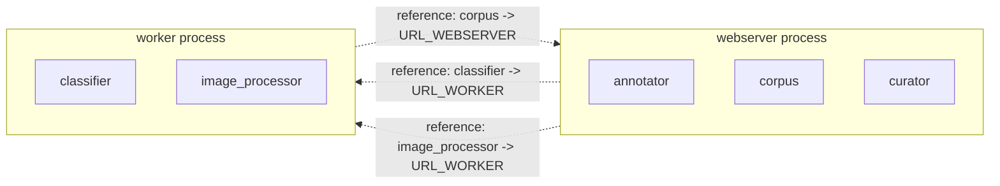
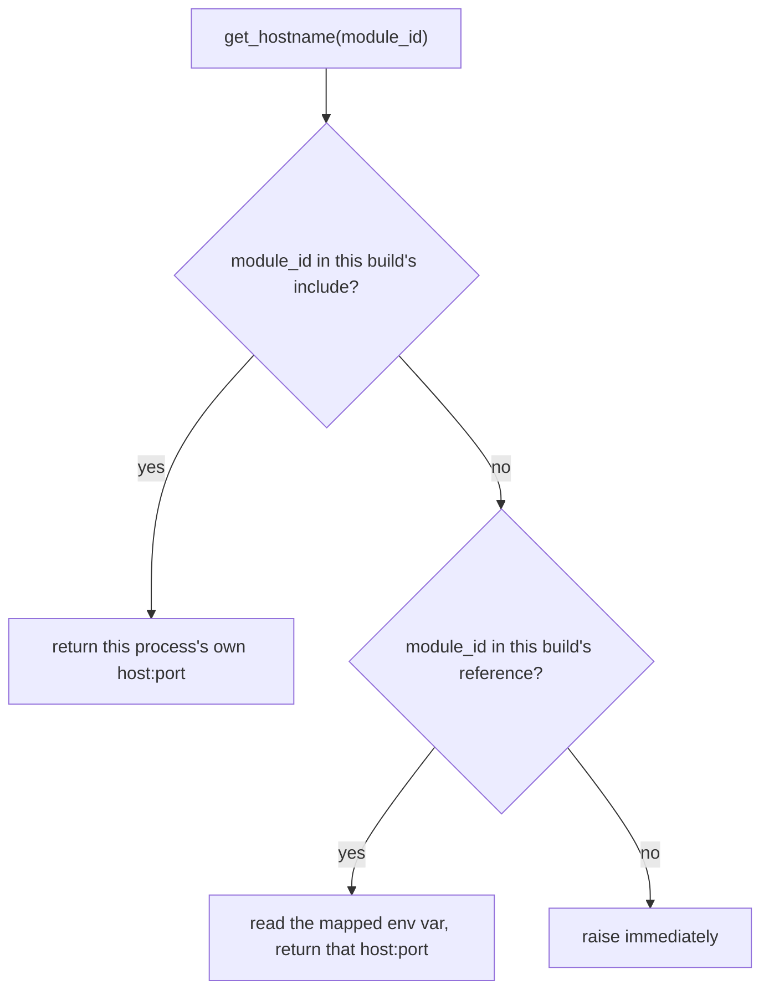

# Sharding

nam is not a monolith - it's one codebase that can run as one process or as
many. A project that outgrows a single machine (or just wants its
GPU-hungry modules scaled independently of its lightweight ones) defines
one or more **builds** in a `builds.yaml` at the project root:

```yaml
webserver:
  optimization: balance
  include:
    - annotator
    - corpus
    - curator
  reference:
    classifier: URL_WORKER
    image_processor: URL_WORKER

worker:
  optimization: throughput
  include:
    - classifier
    - image_processor
  reference:
    corpus: URL_WEBSERVER
```

Each top-level key is a build name, launched with `nam my-project -build
<name>`. A build has:

- `include`: the only modules actually started in this process. Everything
  else in the project is simply not mounted here.
- `reference`: for every module this build doesn't include but still needs
  to reach, maps that module's id to the name of an environment variable
  holding its address (e.g. `reference: {corpus: URL_WEBSERVER}` means
  `os.environ["URL_WEBSERVER"]` holds corpus's `host:port` at runtime).
- `optimization`: optional, overrides the project-level `optimization` for
  processes launched from this build.

The `builds.yaml` example above splits into two processes like this - each
box is a separate OS process, possibly on a separate machine, and the
dotted arrows are the `reference` lookups resolved through `Router` at
request time, not compile-time wiring:



Nothing about `annotator`, `corpus`, `curator`, `classifier`, or
`image_processor`'s own code changes between this sharded layout and
running the whole project unsharded in one process - only which process
each module is `include`d in, and which environment variables happen to
be set, changes. That's the property sharding is built around: a module
never hardcodes where another module lives.

Launching without `-build` at all still works exactly as before - the
whole project runs in one process, as if every module were `include`d in
one implicit build with no `reference` entries.

## Router

Module code never hardcodes another module's address. Instead it asks
`Router.get_hostname(module_id)`, which is build-aware:

```python
from fastapi import Request

def my_route(request: Request):
    corpus_url = request.app.state.router.get_hostname("corpus")
```

- If `module_id` is in this build's `include` list, `get_hostname` returns
  this process's own `http://host:port` - the module is right here.
- If `module_id` is in this build's `reference` map, `get_hostname` reads
  the mapped environment variable and returns that address instead - the
  module lives in some other process.
- If `module_id` is neither included nor referenced, `get_hostname` raises
  immediately, rather than deferring the mistake into a confusing
  connection failure later.

`request.app.state.router` covers any code running inside a FastAPI route.
For code that runs outside a request - background jobs, boot-time
requeues, module-level import side effects - use
`nam.router.get_active_router()` instead, which returns the same `Router`
this process was created with:

```python
from nam.router import get_active_router

def requeue_on_boot():
    image_processor_url = get_active_router().get_hostname("image_processor")
```

A project with no `builds.yaml` (or a launch with no `-build` flag) still
gets a fully working `Router` - every discovered module is implicitly
`include`d, so `get_hostname` always resolves locally and module code never
needs to know whether it's running sharded or as one process.



## API proxying for excluded modules

`Router` is also what nam itself uses to keep every module's declared
`/api` paths reachable in every build. For a module this build `include`s,
nam mounts that module's own `router` onto `/api` directly. For a module
this build only `reference`s (or omits from both), nam instead registers
one proxy route per route the excluded module declares - discovered by
statically parsing its `routes.py` (an AST scan; the module is never
imported, so its actual dependencies never need to be installed in this
process) - at that route's own declared path, and each proxy simply
forwards the request to `Router.get_hostname(id)` and streams the response
back. A caller hitting `/api/trainer_worker/...` gets an identical result
whether `trainer_worker` is mounted right here or sharded off into a
different process across the network - the caller, and that module's own
frontend, never branch on which.
