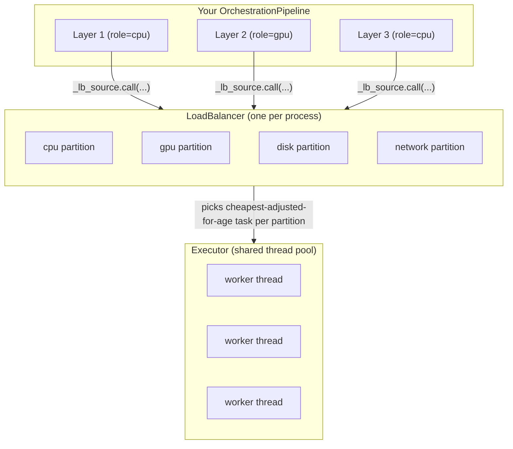
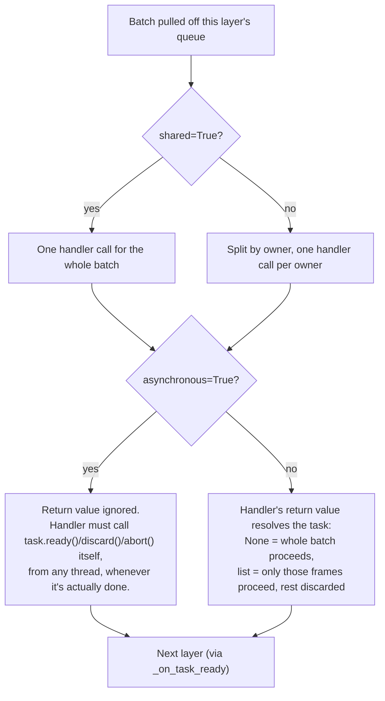
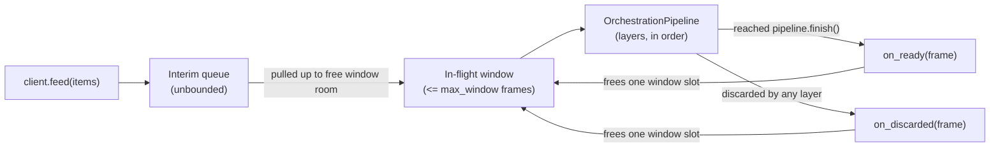

# Concurrency

`nam.concurrency` is initialized once, at server startup, before any module
code imports the orchestrator:

```python
from nam import concurrency
concurrency.initialize()  # defaults to one worker per detected core
```

This sets up a shared thread pool (`concurrency.executor`) and a global
load balancer that every `OrchestrationPipeline` schedules work through.
Modules don't create their own thread pools; they build a pipeline against
the one nam already started.

The pieces underneath, and how work actually gets from a layer to a
worker thread:



Every `OrchestrationLayer` registers its own `LoadBalancerSource` under one
of the four partitions (`role=` in `add_layer`). The `LoadBalancer` keeps a
moving average of how long each source's work actually takes and uses that
to decide what to dispatch next - so a slow `gpu` layer doesn't starve a
fast `cpu` layer sharing the same `Executor`, and a task that's been
waiting too long gets bumped ahead regardless of size. `Executor`'s
threads are undifferentiated: any worker thread may run a batch from any
layer, of any role, at any time - the partitioning happens entirely in the
`LoadBalancer`, not by giving each role its own dedicated threads.

Two more dedicated background threads exist outside this diagram,
independent of the `Executor` pool: a single scheduler thread
(`nam.concurrency.scheduler`) that all layers use for their
`yield_after`/backoff delays instead of each spinning up its own timer
thread, and, only for layers whose handler is an `async def` function, one
dedicated event loop thread per such layer (so `await`-based handlers
don't pay `asyncio`'s loop setup/teardown cost on every batch).

## Pipelines and layers

An `OrchestrationPipeline` is a chain of `OrchestrationLayer`s. Each layer
has a handler, and frames flow from one layer to the next in batches:

```python
from nam.concurrency import OrchestrationPipeline, OrchestrationFrame, OrchestrationClient

pipeline = OrchestrationPipeline(concurrency.executor)

def preprocess(owner, task, batch):
    return [f for f in batch if f.userdata is not None]

def run_model(owner, task, batch):
    for f in batch:
        f.result = model.predict(f.userdata)

pipeline.add_layer(role="cpu", handler=preprocess)
pipeline.add_layer(role="gpu", handler=run_model)
pipeline.finish()
```

Note `run_model` sets `f.result` rather than overwriting `f.userdata`:
`userdata` is whatever you fed in, and handlers generally shouldn't
clobber it with the output. Define a dedicated attribute (like `result`)
on your frame subclass for that instead - see the frame/client pattern
below.

`add_layer` takes:

- `role`: which load balancer partition this layer's work counts against
  (`cpu`, `gpu`, `disk`, or `network`). The load balancer tracks a moving
  average of how long each layer's work takes and schedules accordingly, so
  a slow GPU layer doesn't starve a fast CPU layer sharing the same executor.
- `handler(owner, task, batch)`: called with the batch of frames belonging
  to a single owner. `owner` is whichever value you fed in as an
  `OrchestrationClient`, `task` is a `Task` for signalling completion, and
  `batch` is the list of `OrchestrationFrame`s to process.
- `contiguous`: if `True`, a frame only leaves this layer once every frame
  before it (by index, for the same owner) has already left. Useful for
  layers where output order must match input order.
- `min_batch` / `max_batch`: batch size bounds. A layer won't call its
  handler until at least `min_batch` frames are queued, or `yield_after`
  seconds have passed, whichever comes first.
- `shared`: if `True`, the handler is called once per batch across all
  owners, instead of once per owner.
- `asynchronous`: if `True`, the layer doesn't wait for the handler to
  return before moving on. The handler is responsible for calling
  `task.ready(...)` or `task.abort()` itself, whenever it's actually done
  (which can be from another thread, later).

Put together, this is what happens to one pulled batch inside
`_execute_batch`, matching the code path exactly (`shared` decides how the
batch is grouped before the handler runs at all; `asynchronous` decides
whether anything downstream happens on return at all):



A handler that calls `task.ready()`/`discard()`/`abort()` itself under
`asynchronous=False` is also fine, and wins over the return value if it
resolves first (it always does, since it necessarily runs before the
handler can return) - but returning a non-`None` value on top of that is a
bug: the return value is silently discarded and logged as a conflict,
since the manual call already settled the task. Do exactly one or the
other.

## Handler return values

For a non-asynchronous layer, what the handler returns decides what
proceeds to the next layer:

- Returning `None` (including simply not returning anything) passes the
  whole batch through unchanged.
- Returning a list of frames passes through only those frames. Anything in
  the original batch that isn't in the returned list is discarded: it
  won't reach the next layer, and it won't be requeued.

```python
def filter_bad_frames(owner, task, batch):
    return [f for f in batch if f.userdata.is_valid]
```

## Tasks

Every handler call gets a `Task`. Calling `task.ready(batch)` explicitly
does the same job as a return value, but works for asynchronous layers too,
and can be called from a different thread than the one that ran the
handler:

```python
def dispatch_to_worker(owner, task, batch):
    def on_worker_done(results):
        survivors = [f for f, r in zip(batch, results) if r is not None]
        task.ready(survivors)

    worker_pool.submit(batch, callback=on_worker_done)

pipeline.add_layer(role="gpu", handler=dispatch_to_worker, asynchronous=True)
```

`task.ready()` with no argument passes the whole original batch through,
same as returning `None`. `task.abort()` discards the whole batch, the same
as `task.ready([])`.

Both `ready()` and `discard()` also accept a single `OrchestrationFrame`
instead of a batch - useful in asynchronous layers where frames finish one
at a time rather than all together:

```python
def dispatch_to_worker(owner, task, batch):
    def on_item_done(frame, result):
        if result is None:
            task.discard(frame)
        else:
            frame.result = result
            task.ready(frame)

    for f in batch:
        worker_pool.submit(f, callback=on_item_done)

pipeline.add_layer(role="gpu", handler=dispatch_to_worker, asynchronous=True)
```

A task settles on its first `ready()`/`discard()`/`abort()` call made
*without* a specific frame or batch (i.e. resolving the whole task at
once). After that, further single-frame `ready(frame)`/`discard(frame)`
calls are still honored as long as they name frames that haven't already
been claimed - this is what lets a streaming/asynchronous handler resolve
frames one at a time as they complete, from any thread, without every
frame needing to be ready simultaneously. Once every frame in the batch
has been claimed, the task is fully resolved.

### Retrying

`task.retry(backoff, batch=None)` re-submits frames back into this same
layer instead of forwarding them downstream or dropping them - useful for
a handler that hit a transient failure (a flaky upstream call, a
momentarily saturated resource) and wants those frames re-run through its
own handler again rather than failing them outright:

```python
def call_flaky_backend(owner, task, batch):
    try:
        for f in batch:
            f.result = flaky_backend.call(f.userdata)
    except TransientError:
        task.retry(500)  # re-run the whole batch again in 500ms
        return
    return batch

pipeline.add_layer(role="network", handler=call_flaky_backend)
```

`backoff` is milliseconds. `batch` follows the same shape rules as
`ready()`/`discard()` (a list, a single `OrchestrationFrame`, or omitted)
but `None` means something different here: for `ready()`/`discard()`,
omitting `batch` means "the whole original batch"; for `retry()` it means
"whatever hasn't already been readied/discarded/retried" - which matters
because retry() is usually mixed with a partial `ready()`/`discard()` in
the same handler call (retry the failures, ready the successes), and you
don't want to accidentally re-submit frames that already succeeded.

Naming a frame in `batch` that some earlier `ready()`/`discard()`/
`retry()` call already claimed is a handler bug - a warning is printed
and that frame is filtered out of the retry rather than being silently
re-submitted twice or silently dropped. Frames genuinely outside the
task's batch are still filtered out silently, same as `ready()`/
`discard()` already do.

`retry()` follows the same first-call-settles / later-calls-stream
contract as `ready()`/`discard()`: it can be combined with them (e.g.
`ready()` the frames that succeeded, `retry()` the ones that didn't, in
the same handler invocation), and, under `asynchronous=True`, called
later from any thread as each frame's outcome becomes known.

There's no built-in retry limit or backoff-growth policy - a handler that
wants max-attempts or exponential backoff tracks that itself (e.g. a
counter on the frame's `userdata`) and calls `task.discard()`/`abort()`
once it gives up. A retried frame re-enters this layer's queue exactly
like a fresh frame handed in by `push_batch()` from upstream: the same
layer's `contiguous`, `min_batch`/`max_batch`, and capacity backpressure
all apply to it.

## OrchestrationClient

`OrchestrationClient` sits in front of a pipeline and manages a bounded
window of in-flight work for one logical caller. Prefer subclassing it
over using the lower-level `Orchestrator` directly - see the
`FirstClient`/`SecondClient` pattern in
`examples/nested_orchestration.py` for the recommended shape:

```python
class MyFrame(OrchestrationFrame):
    def __init__(self, index, userdata):
        super().__init__(userdata=userdata)
        self.result = None

class MyClient(OrchestrationClient):
    def __init__(self):
        super().__init__(pipeline, max_window=256)

    def _create_frame(self, index, userdata):
        return MyFrame(index, userdata)

client = MyClient()
client.on_ready(lambda frame: print(frame.result))
client.feed([item_a, item_b, item_c])
```

Each item you feed becomes a frame (via `_create_frame`) and enters the
pipeline at the first layer. `max_window` caps how many frames can be in
flight at once; once frames finish (reach the end of the pipeline, added
with `pipeline.finish()`), room frees up and more queued items are pulled
in. Register `on_ready`/`on_discarded` callbacks to get frames back one at
a time as they complete or get dropped, and `on_dispatch` if you need to
record caller-side context per fed item (see the docstring on
`OrchestrationClient` for the nested-client use case this is for).



Feeding more items than `max_window` doesn't block or error - they queue
in the unbounded interim queue and get pulled into the window as slots
free up. This is what actually provides backpressure: a slow pipeline
just means the window stays full and the interim queue grows, rather than
every fed item spawning unbounded concurrent work.

Call `client.close()` when you're done with it, to clear any per-owner
backlog state held by `contiguous` layers.

The lower-level `Orchestrator(pipeline, max_window)` that `OrchestrationClient`
wraps is still available directly if you don't need per-item frame
subclassing, but for most module code the client pattern above is what
you want.
